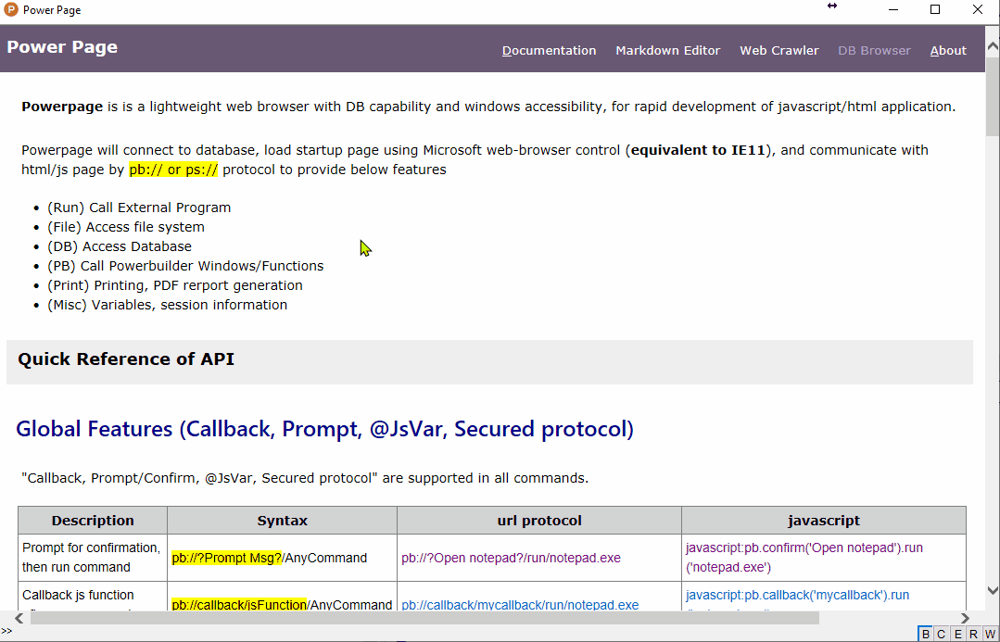

## Introduction

[**PowerPage**](https://github.com/casualwriter/powerpage) is a lightweight web browser with DB capability 
and windows accessibility, for rapid development of javascript/html/css application.

 

Powerpage will connect to database, load startup page using Microsoft web-browser control (**equivalent to IE11**), 
and communicate with html/js page by ``pb:// or ps://`` protocol to provide below features

* (Run) Call External Program 
* (File) Access file system 
* (DB) Database Accessibility
* (PB) Call Powerbuilder Windows/Functions 
* (Misc) Global variables, sessions information 

### Motivation

For security reason, all browsers are working hard to prevent unauthorized access of OS resources (ie. printer, files, database etc..).
In other side, developers working hard to access OS resources for application development. Development within web-browser just like 
a game of police-theft. 
 
I had longed for a web browser which has DB connectivity and OS accessibility, 
so that can coding JavaScript/html/css application like Electron.

Somehow, quite frustrated in many "installation" works, to setup development evnironment and deploy application. 
It always goes wrong by unknown reasons and stuck into unknown situations. 
What I want is "copy-and-run" and "code-and-play" (i.e. no installation, no compile, no deployment). 

I try to make "Powerpage" solution for this purpose.  

### Features

Powerpage is a ready-make Electron-like solution. No install, no compile, no packing. Just open editor to start coding.

* Portable solution. No installation
* Single execute file. No deployment.
* No dependance, pure js/html/css
* Code-and-Play instantly 
* Make use of all javascript library (which support IE11)
* Command Line for multiple purpose (e.g. save url page, generate PDF)
* Work with Powerbuilder (e.g. call powerbuilder window/function/datawindow)

ps: due to the limitation of Microsoft web-browser control, Powerpage web browser is **equivalent to IE11 (not chrome)**!

### Run Powerpage

Powerpage is a single executable program. No installation is needed, just download and run ``powerpage.exe``.

* Simply download from "release" folder, unzip the file, and run ``powerpage.exe``
* Source code and latest version can be downloaded from "source" folder. 

### Files & Applications

* ``powerpage.exe`` is the executable file of powerpage. (single executable file)
* ``powerpage.html`` is the startup html file (i.e. javascript/html application)
* ``powerpage.ini`` is the config file for DB connection and misc setup
* ``powerpage.js`` is the initial javascript lib for interface
* ``*.dll`` is Powerbuilder run-time files

**Source code**

Powerpage is developed by Powerbuilder 10.5, source code is powerpage.pbl (only one file)  

* `powerpage.pbl` is powerbuilder source code 
* `powerpage.pbt` is powerbuilder target file
* exported source entries can be found under folder [src\*](https://github.com/casualwriter/powerpage/tree/main/source/src)
* to compile the program, add `powerpage.pbt` to workspace, and compile by `p_powerpage` 

**Applications**

* ``pp-md-editor.html`` is pp-application of "Powerpage Markdown Editor"
* ``pp-web-crawler.html`` is pp-application of "Powerpage Web Crawler"
* ``pp-db-report.html`` is pp-application of "Powerpage DB Reports"

### How PowerPage work?

Powerpage open a window with MS WebBrowser Control. When HTML page is loaded, Powerpage will import ``powerpage.js`` 
to initialize ``pb`` javascript object to provide Powerpage interface.

HTML page may via the following channel to talk to main program

1. recommented call by javascript: ``pb.apiFunction()``, e.g. pb.run('notepad.exe')
2. by url: ``&lt;a href="pb://command/parameters">Text&lt;/a>`` or ``window.location = "pb://command/parameters"``
3. by change title: ``document.title = "pb://command/parameters"``

Powerpage will interpret and execute the command, and pass the result to HTML page by calling js function ``pb.router(callback, result, type, cmd)``

for example:

* Run notepad.exe to edit powerpage.ini -> ``javascript:pb.run('notepad.exe powerpage.ini')`` or ``pb://run/notepad.exe powerpage.ini``
* Run SQL1 and callback showData() -> ``javascript:pb.callback('showData').db.query(sql1)`` or ``pb://callback/showData/db/query/@sql1``  
* Run update SQL2 -> ``javascript:pb.db.execute(sql3)`` or ``pb://db/execute/@sql3``
* Call About window -> ``javascript:pb.window('w_about')`` or ``pb://window/w_about`` 

For more details, please refer to [API documentation](interface.md)

  
## Command Line

Beside running javascript applications, Powerpage has wide usage by using commandline parameters.

~~~
powerpage.exe /ini={ini-file} /url={start-url}  /script={script-file} /fullscreen /print /silent
              /save={save-html} /pdf={output-pdf-file} /select={selector} /delay={1000}
~~~

* `/ini={ini-file}` specifies ini setting file. Aplication could be changed by change the ini file.
* `/url={start-url}` is used to specify startup link. Aplication could be changed by change startup link.
* `/script={script-file}` will specify user-defined javascript instead of `powerpage.js`. useful for js injection. 
* `/fullscreen` or `/kiosk` will run in fullscreen mode, useful for kiosk, or display board.
* `/silent` will run in silent mode (i.e. suppress js error message)
* `/print`` will load startup url, print and close program.
* `/save={save-html}` will load startup url, save to html file, and close program.  Useful for web-crawler
* `/pdf={output-pdf-file}` will load startup url, generate PDF file, and close program. useful for PDF generation.
* `/delay={1000}` specifies delay time (by milliseconds) for print/save/pdf options
* `/select={css-selector}` is applied for **print/save** to select part of html elements.  Useful for web-crawler

### Samples of using command-line

**General Usage**
* ``powerpage.exe /ini=pp-md-editor.ini`` run "Powerpage Markdown Editor" with its config ini
* ``powerpage.exe /url=pp-md-editor.html`` run "Powerpage Markdown Editor"
* ``powerpage.exe /url=pp-web-crawler.html`` run "Powerpage Web Crawler"
* ``powerpage.exe /url=pp-kanban.html /fullscreen`` run Kanban display board in fullscreen mode
* ``powerpage.exe /url=pp-md-document.html`` open "Powerpage Documents"
* ``powerpage.exe /url=facebook.com`` /script=myfacebook.js`` inject js script for facebook.com

**print page or save to html/pdf**
* ``powerpage.exe /url=http://haodoo.net/ /print`` print page of haodoo.net
* ``powerpage.exe /url=http://haodoo.net/ /pdf=haodoo.pdf`` save the page of haodoo.net to PDF file
* ``powerpage.exe /url=http://haodoo.net/ /save=haodoo.html`` save page "haodoo.net" to haodoo.html

**save web content to file (whole page or select by css-selecotr)**
* ``powerpage.exe /url=https://pingshan-tech.com/powerpage/doc /save=README.html`` save powerpage README (whole page)
* ``powerpage.exe /url=https://pingshan-tech.com/powerpage/doc /save=README.html /select=#content`` save powerpage README (#content:outerHTML)
* ``powerpage.exe /url=https://pingshan-tech.com/powerpage/doc /save=README.html /select=@#content`` save powerpage README (#content:innerText)
* ``powerpage.exe /url=https://pingshan-tech.com/powerpage/doc /save=README.html /select=#right-panel`` save powerpage README (#right-panel)

**save github content to html/pdf (select==.markdown-body)**
* ``powerpage /url=https://github.com/casualwriter/powerpage /save=README.html /select=.markdown-body`` to save README from github (has error msg)
* ``powerpage /url=https://github.com/casualwriter/powerpage /save=README.html /select=.markdown-body /silent`` to save README from github (silent mode)
* ``powerpage /url=https://github.com/casualwriter/powerpage /pdf=README.pdf /select=.markdown-body /silent`` to save in PDF format

   
## Application Samples

Powerpage is released with some sample applications.

* [Powerpage](https://github.com/casualwriter/powerpage) as Quick Reference, or self-demonstration
* [Powerpage - Markdown Editor](https://github.com/casualwriter/powerpage-md-editor) 
* [Powerpage - Web Crawler](https://github.com/casualwriter/powerpage-web-crawler) 
* Powerpage - [Document By Markdown](https://github.com/casualwriter/powerpage-md-document) 
 
  
## Modification History

* 2021/05/07, v0.41 
* 2021/05/14, v0.43, with markdown editor [powerpage-md-editor](https://github.com/casualwriter/powerpage-md-editor)
* 2021/05/25, v0.46, commandline for html printing
* 2021/06/03, v0.48, generate PDF report (using wkhtmltopdf.exe)
* 2021/06/16, v0.50, more command line options
* 2021/07/02, v0.54, crawl web function, add [powerpage-web-crawler](https://github.com/casualwriter/powerpage-web-crawler)
* 2021/07/08, v0.55, refine powerpage, update [powerpage-web-crawler](https://github.com/casualwriter/powerpage-web-crawler)
* 2021/07/20, v0.56, add pb://spider command; update [powerpage-web-crawler](https://github.com/casualwriter/powerpage-web-crawler)
* 2021/10/05, v0.57, code document framework pp-document.html, update documents
* 2021/10/06, code document framework (html version) at [doc/index.html](https://github.com/casualwriter/powerpage/blob/main/source/doc/index.html)
* 2021/10/12, v0.58, update documents with [markdown parser](https://github.com/casualwriter/powerpage/blob/main/source/doc/index.html)
* 2021/10/14, v0.60, align all version (powerpage-md-editor,powerpage-web-crawler) to v0.60
* 2021/10/15, v0.61, support commandline option: /select={selector}
* 2021/10/20, v0.62, minor fix of markdown parser; show [system document](https://ghcdn.rawgit.org/casualwriter/powerpage/main/source/doc/index.html) directly from github  
* 2021/11/02, v0.63, update pb source \src\*.*; remove local documents, host in [github-page](https://casualwriter.github.io/powerpage) now.
 

## To-Do List

* document: API
* document: development
* secure desktop application by web-hosting
* refine layout of powerpage-md-editor and powerpage-web-crawler 
* api: app.registry( 'get|set|delete', key, values ) 
* api: app.loadIniFile() => read ini file, return json.
* api: app.datawindow( id, params ) => popup datawindow report in dw syntax but in html.  
* app: "powerpage-db-report" - db reporting utility.  
* app: "powerpage-kanban" - simple kanban utility for teamwork.  

