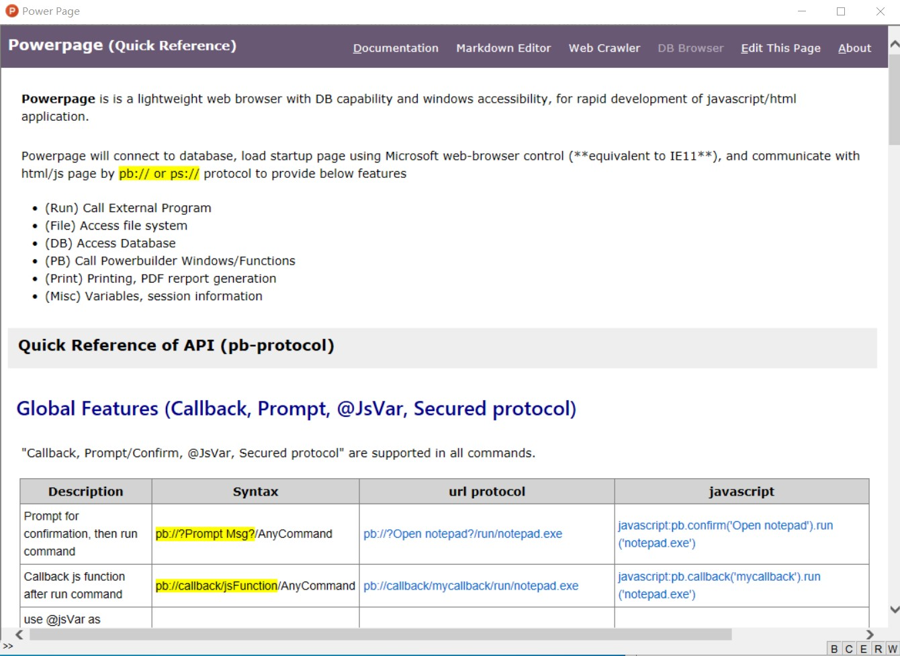

## Introduction

[**PowerPage**](https://github.com/casualwriter/powerpage) is a lightweight web browser with DB capability 
and windows accessibility, for making Electron-like HTML/JS GUI apps

Powerpage will connect to database, and load startup page by the setting of powerpage.ini, and open 
OLE web-browser with new protocol pb:// or ps:// to provide below features
 
* (Run) Call External Program 
* (File) Access file system 
* (DB) Database Accessibility
* (PB) Call Powerbuilder Windows/Functions 
* (Misc) Variables, session information 

### Installation & Run

Powerpage is a single executable program. No installation is needed, Just download and run.

* Simply download from "release" folder, and unzip the file, and run ``powerpage.exe``
* Source code and latest version can be downloaded from "source" folder. 

### Files

  * powerpage.exe  // powerpage executable file. (single file)
  * Powerpage.htlm // Startup html file of powerpage 
  * Powerpage.ini  // Ini file of powerpage
  * Powerpage.js   // Javascript lib of powerpage
  * *.dll          // Powerbuilder run-tie files

### How PowerPage work?

Powerpage open a window with MS OLE Web brwoser. When HTML page load, powerpage will import ``powerpage.js`` to initalize ``pb`` javascript object to provide powerpage interface.

HTML page may via the following channel to talk to main program

1. window.location = "pb://protocol/command"
2. doument.title = "pb://protocol/command"
3. javascript pb.apiFunction()

Powerpage will interpret and execute the command, and pass the result to HTML page by calling js function ``pb.router( result, type, cmd)``

## Protocol Commands

Interface is provided by ``pb://`` protocol command, or javascript ``pb.`` API function call.  HTML Page may use 

``<a href="pb://protocol/command"> pb://protocol/command</a> `` or javascript:pb.apiFunction()`` to make powerpage API call.

for example:

* Run notepad.exe to edit powerpage.ini -> ``pb://run/notepade.exe powerpage.ini`` or ``javascript: pb.run('notepad.exe powerpage.ini')``
* Run SQL1 and callback showData() -> ``pb://callback/showData/sql/query/@sql1`` or ``javascript: pb.callback('showData').db.query(sql1)`` 
* Run update SQL2 -> ``pb://sql/execute/@sql2`` or  ``javascript: pb.db.execute(sql2)`` 

For more details, please refer to [API documentation](interface.md)

### Modification History

* 2021/05/07, beta version, v0.41 
* 2021/05/10, beta version, v0.42, with sample of markdown editor

### License

MIT

