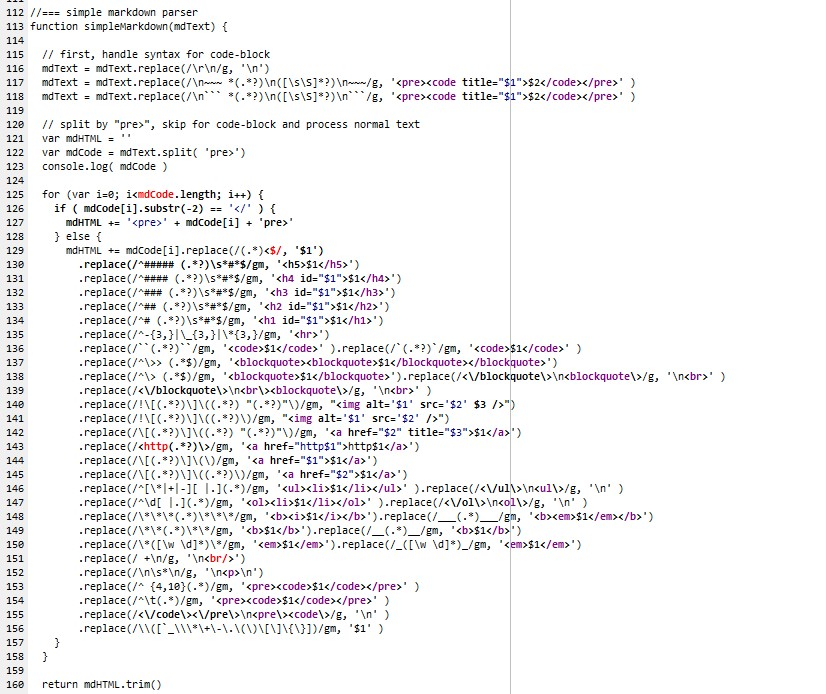
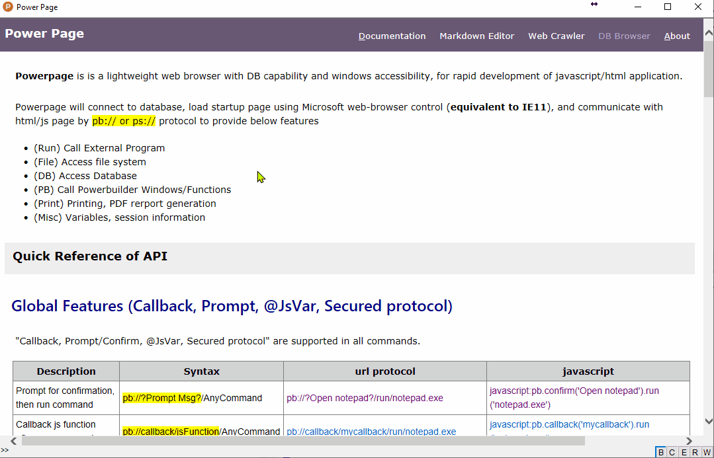

## Document by Markdown

This program, ``pp-document.html``, is a powerpage-application to show markdown documents.

It may work as document framework serve the following purpose

1. show markdown file as documentation
2. make powerpage API call from markdown (e.g. [edit src](pb://run/notepad.exe pp-document.html))
3. write simple application by markdown.
   

### Menu of Markdown Documents

The list of document is coded in HTML as below

~~~~~

  Powerpage <small>(documentation)</small>
  
    <button onclick="loadMdFile('doc/README.md',this.innerText)">Home</button>
    <button onclick="loadMdFile('doc/interface.md',this.innerText)">API</button>
    <button onclick="loadMdFile('doc/development.md',this.innerText)">Development</button>
    <button onclick="loadMdFile('doc/pp-document.md')">Document.md</button>
    <button onclick="loadMdFile('doc/pp-markdown.md')" disabled>Markdown-Editor</button>
    <button onclick="loadMdFile('doc/pp-web-crawler.md')" disabled>Web-Crawler</button>
    <button onclick="loadMdFile('doc/pp-db-report.md')" disabled>DB-Reports</button> | 
    <button onclick="toggleHTML()">HTML</button> 
    <button onclick="pb.print('preview')">Print</button>
    <button onclick="pb.window('w_about')">About</button>
  

~~~~~

 
### Simple TOC

simpleTOC() retrieve all "H2,H3,H4" elements, and generate "table of content" to left-panel.

~~~~~
//=== simpleTOC: show Table of Content
function simpleTOC( title, srcDiv, toDiv ) {
  var toc = document.getElementById(srcDiv||'right-panel').querySelectorAll('h2,h3')
  var html = '<h4> ' + (title||'Content') + '</h4><ul id="toc">';

  for (var i=0; i<toc.length; i++ ) {
  
  	if (!toc[i].id) toc[i].id = "toc-item-" + i;
    
  	if (toc[i].nodeName === "H2" && toc[i].innerText.substr(-3)!=="###" ) {
  		html += '<li style="background:#f6f6f6"><a href="#' + toc[i].id + '">' + toc[i].innerText + '</a></li>';
  	} else if (toc[i].nodeName === "H3" && toc[i].innerText.substr(-3)!=="###" ) {
  		html += '<li style="margin-left:12px"><a href="#' + toc[i].id + '">' + toc[i].innerText + '</a></li>';
  	} else if (toc[i].nodeName === "H4" &&  toc[i].innerText.substr(-3)!=="###" ) {
  		html += '<li style="margin-left:24px"><a href="#' + toc[i].id + '">' + toc[i].innerText + '</a></li>';
  	}
    
  }

  document.getElementById(toDiv||'left-panel').innerHTML = html   
}
~~~~~
  
  
### Simple Scroll-Spy

listen to onscroll event, check the position of all TOC items, and highlight these TOC items shown in viewport.

~~~~~
//=== scrollspy feature
document.getElementById('right-panel').onscroll = function () {
  var list = document.getElementById('left-panel').querySelectorAll('a')
  var divScroll = document.getElementById('right-panel').scrollTop - 10
  var divHeight = document.getElementById('right-panel').offsetHeight
  
  for (var i=0; i<list.length; i++) {
    var pos = document.getElementById(list[i].innerText).offsetTop - divScroll  
    list[i].style['font-weight'] = ( pos>0 && pos<divHeight ? 600 : 400 )
  }
}
~~~~~

  
### Simple Markdown

Considered to call js lib for markdown parser. However, some may too heavy, and some do not support IE11.
 
Finally write a simple markdown parser in below codes:

 

 
  
## Supported Markdown Syntax
 
refer to [https://www.markdown.xyz/basic-syntax/]() for the simple markdown syntax 

### Heading 

<table border=1><tr><th>Markdown<th>result<th>layout</tr>
<tr><td>
<pre>
may add multiple # in right side.  
more than ### will skip TOC

# heading 1
## heading 2 ###   
### heading 3 ###  
#### heading 4 ########
##### heading 5
</pre>
<td><xmp>
# heading 1
## heading 2
### heading 3
#### heading 4
##### heading 5
</xmp>
<td>
# heading 1   
## heading 2 ###   
### heading 3 ###  
#### heading 4 ########
##### heading 5
</td></tr></table>
 
### Bold and Italic

<table border=1><tr><th>Markdown<th>HTML<th>Rendered Layout</tr>
<tr><td>
~~~
this is **bold** sample  
this is *italic* sample  
this is _italic_ sample  
this is ***bold+italic*** sample  
this is ___bold+italic___ sample  
this is __underline__ sample  
this is ~~Strikethrough~~ sample   
this is ~~delete~~ then ^^insert^^ sample    
~~~
<td><xmp>
this is **bold** sample  
this is *italic* sample  
this is _italic_ sample  
this is ***bold+italic*** sample  
this is ___bold+italic___ sample  
this is __underline__ sample  
this is ~~Strikethrough~~ sample   
this is ~~delete~~ then ^^insert^^ sample    
</xmp>
<td>
this is **bold** sample  
this is *italic* sample  
this is _italic_ sample  
this is ***bold+italic*** sample  
this is ___bold+italic___ sample  
this is __underline__ sample  
this is ~~Strikethrough~~ sample   
this is ~~delete~~ then ^^insert^^ sample    
</td></tr></table>

### Paragraph, Line Breaks and HR

<table border=1><tr><th>Markdown<th>HTML<th>Rendered Layout</tr>
<tr><td>
~~~
Don't put tabs or spaces in front of your paragraphs.

Keep lines left-aligned like this.

This is the first line.   
And this is the second line.
~~~
<td><xmp>
Don't put tabs or spaces in front of your paragraphs.

Keep lines left-aligned like this.

This is the first line.    

And this is the second line.
</xmp>
<td>
Don't put tabs or spaces in front of your paragraphs.

Keep lines left-aligned like this.

This is the first line.   
And this is the second line.
</td></tr><tr><td>
~~~
Use - or _ or * for horizontal rule.

-------- 
________
  
********
~~~
<td><xmp>
Use - or _ or * for horizontal rule.

-------- 
________
  
********
</xmp>
<td>
Use - or _ or * for horizontal rule.

-------- 
________
  
********
</td>
</tr></table>
 
 
### Blockquote and Code-Block

<table border=1><tr><th>Markdown<th>HTML<th>Rendered Layout</tr>
<tr><td>
~~~
> blockquote line1
> blockquote line2
>> blockquote line3
>> blockquote line4
> Below is empty line
>         
> line 5

this is `code block` in same line 
another ``code block`` in same line
~~~
<td><xmp>
> blockquote line1
> blockquote line2
>> blockquote line3
>> blockquote line4
> Below is empty line
>         
> line 5

this is `code block` in same line 
another ``code block`` in same line
</xmp>
<td>
> blockquote line1
> blockquote line2
>> blockquote line3
>> blockquote line4
> Below is empty line
>         
> line 5

this is `code block` in same line 
another ``code block`` in same line
</td></tr></table>

### Lists

<table border=1><tr><th>Markdown<th>HTML<th>Rendered Layout</tr>
<tr><td>
~~~
use *|+|- for unorder list

* item 1
* item 2
* item 3

another list
+ item 1
+ item 2

another list
- item 1
- item 2
~~~
<td><xmp>
use *|+|- for unorder list

* item 1
* item 2
* item 3

another list
+ item 1
+ item 2

another list
- item 1
- item 2
</xmp><td>
use *|+|- for unorder list

* item 1
* item 2
* item 3

another list
+ item 1
+ item 2

another list
- item 1
- item 2
</td></tr>
<tr><td>
~~~

use number [0-9] with dot for ordered list.

1. one 
1. two
0. three
4. Four

~~~
<td><xmp>

use number [0-9] with dot for ordered list.

1. one 
1. two
0. three
4. Four

</xmp>
<td>

use number [0-9] with dot for ordered list.

1. one 
1. two
0. three
4. Four

</td>
</tr></table>

 
### Links and Images

<table border=1><tr><th>Markdown<th>HTML</tr>
<tr><td>
~~~
* Link to [google](https://google.com)
* Link with title [youtube](https://youtube.com "hints")
* quick link1 &lt;https://youtube.com> 
* quick link2 [https://youtube.com]() 

* Show 
* Show Image with additional options 
       
~~~

<td><xmp>
* Link to 
 [google](https://google.com)
* Link with title 
 [youtube](https://youtube.com "hints")
* quick link1 <https://youtube.com> 
* quick link2 [https://youtube.com]() 

* Show Image 
       
* Show Image with additional options 
       
</xmp><td>
</tr></table>

** Rendered Layout **

* Link to [google](https://google.com)
* Link with title [youtube](https://youtube.com "hints")
* quick link1 <https://youtube.com> 
* quick link2 [https://youtube.com]() 

* Image  
    
* Image with width 
    

   
### Escaping Characters

<table border=1><tr><th>Markdown<th>HTML<th>Rendered Layout</tr>
<tr><td>
~~~
\` \_ \\ \* \+ \- \.   
\( \) \[ \] \{ \}
~~~
<td><xmp>
\` \_ \\ \* \+ \- \.   
\( \) \[ \] \{ \}
</xmp>
<td>
\` \_ \\ \* \+ \- \.   
\( \) \[ \] \{ \}
</td>
</tr></table>

 
## To-Do

- [v] some enhance synatx (underline,Strikethrough,highlight)
- [x] support check list (cancelled! no need)
- [ ] support table syntax
- [ ] Frontmatter :=  ---\name: value\n--- 
- [ ] use Frontmatter for markdown-application 

 
## Modification History

* 2021/10/05, v0.48, initial version
* 2021/10/06, v0.50, html version, and minor revision 
