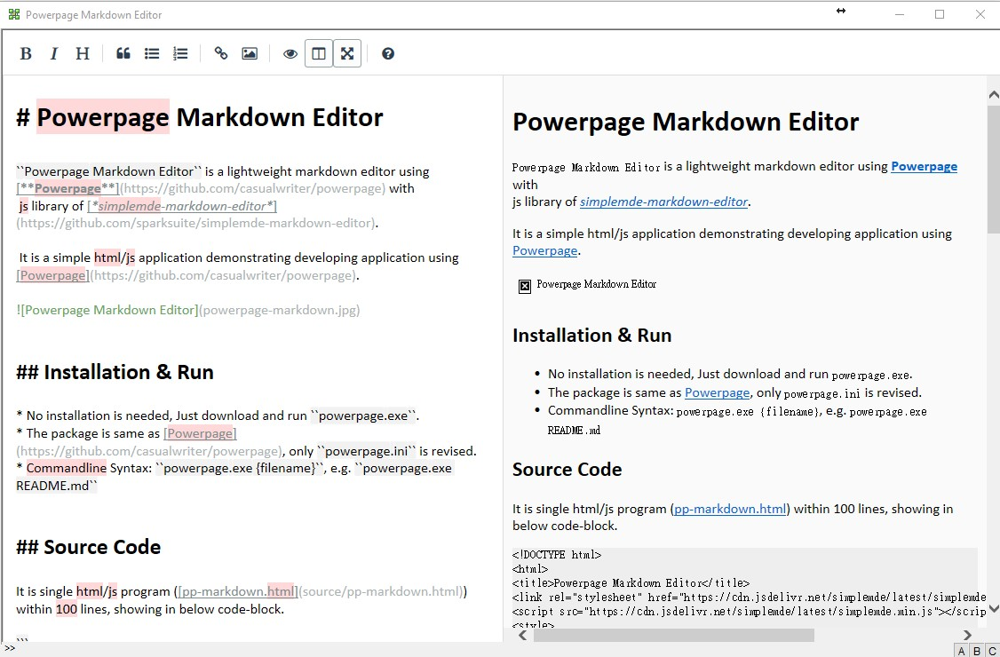

## Powerpage Markdown Editor

``Powerpage Markdown Editor`` is a lightweight markdown editor using [**Powerpage**](https://github.com/casualwriter/powerpage) with 
 js library of [*simplemde-markdown-editor*](https://github.com/sparksuite/simplemde-markdown-editor). 
 
 It is a simple html/js application demonstrating developing application using [Powerpage](https://github.com/casualwriter/powerpage).

### Installation & Run

* No installation is needed, Just download and run ``powerpage.exe``.
* The package is same as [Powerpage](https://github.com/casualwriter/powerpage), only ``powerpage.ini`` is revised.
* Commandline Syntax: ``powerpage.exe {filename}``, e.g. ``powerpage.exe README.md``

### Source Code

It is single html/js program ([pp-md-editor.html](source/pp-md-editor.html)) within 100 lines. 
  
  
## Modification History

* 2021/05/14, v0.50, first version with powerpage v0.43
* 2021/05/30, v0.55, add print preview function
* 2021/06/16, v0.60, print preview, commandline, etc.. (using powerpage v0.50)
* 2021/07/04, v0.61, minor fix, with powerpage v0.54, and power-web-crawler v0.30
* 2021/07/09, v0.62, minor fix, with powerpage v0.55, and power-web-crawler v0.40
* 2021/07/20, v0.62, update source folder, align with powerpage v0.56, and power-web-crawler v0.56
  

## License

MIT

